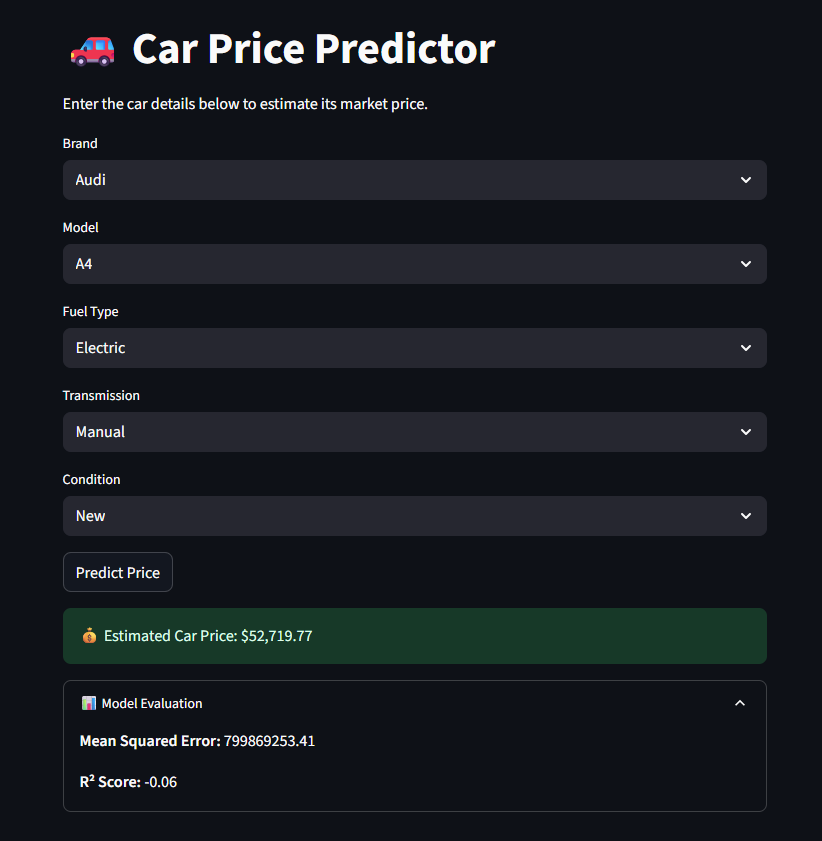

# 🚗 Car Price Predictor using Random Forest

Predict the market value of a car based on its specifications using machine learning. This project uses one-hot encoding and a **Random Forest Regressor** to estimate car prices with real-time input via a simple web interface built using **Streamlit**.

---

## 🧠 About the Project

This project demonstrates a regression-based machine learning pipeline for predicting car prices. It includes:

- Data preprocessing and encoding of categorical features  
- Model training using **Random Forest Regressor**  
- Evaluation with **Mean Squared Error** and **R² Score**  
- Interactive app built with **Streamlit**

---

## 🚀 Features

- 📊 Clean and preprocess real-world car data  
- 🔁 Convert categorical features using one-hot encoding  
- 🤖 Train a Random Forest model to predict prices  
- ✅ Real-time prediction from user input via web interface  
- 📉 Performance metrics: MSE and R² Score

---

## 🛠️ Tech Stack

- Python 3.x  
- pandas  
- scikit-learn  
- streamlit  

---

## 📁 Project Structure

```
Car-Price-Predictor/
├── app.py                      # Streamlit app script
├── app.ipynb                   # Jupyter Notebook
├── car_price.csv               # Dataset of car listings
├── README.md                   # Project documentation
├── requirements.txt            # List of dependencies
├── images                      # Images folder
    ├── app_preview.png         # Preview image of the app
```

---

## 💻 How to Run

1. **Clone the Repository**
```bash
git clone https://github.com/saadtoorx/Car-Price-Predictor-using-RF.git
cd car-price-predictor
```

2. **Install Dependencies**
```bash
pip install -r requirements.txt
```

3. **Run the App**
```bash
streamlit run app.py
```

4. **Use the App**
- Select the car's brand, model, fuel type, transmission, and condition  
- Click “Predict Price” to see the estimated market value 💰

---

## 📷 Preview

*(Optional image if available — place it in an `images/` folder)*  


---

## 🧾 License

This project is licensed under the [MIT License](LICENSE)

---

## 👤 Author

Made with 💡 by [@saadtoorx](https://github.com/saadtoorx)  
If you like it, ⭐ the repo and feel free to fork!
